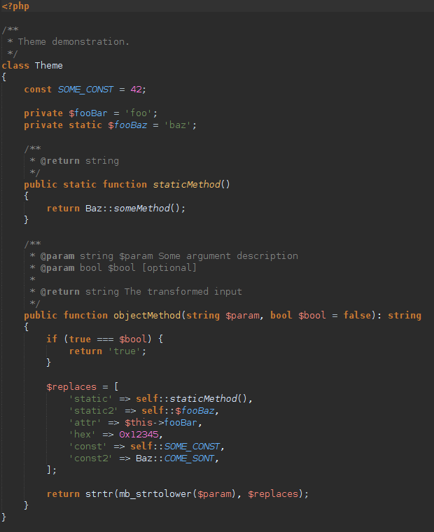
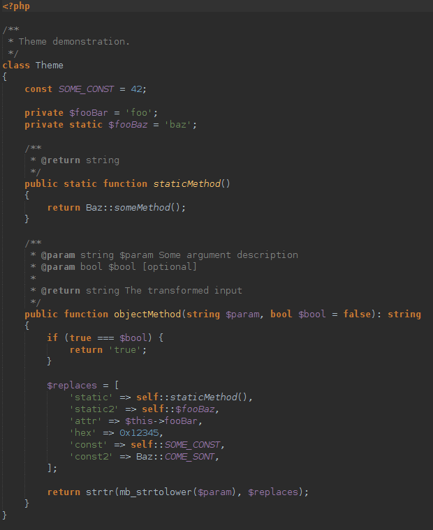

# Modified Darcula theme for Netbeans

This theme contains font, and color adjustments for PHP development:

 - Different style for local variables
 - Color adjustments for numbers, constants, attributes, identifiers

## Install

1. Open the Options dialog (*Tools* -> *Options*)
2. Click on *Import...*
3. Select the config file in `theme/Dracula-Mod-Theme.zip` and click *OK*
4. Click *Yes* in the prompt window. The IDE will restart, and the newly installed theme will be used.

## Uninstall

1. Open the Options dialog (*Tools* -> *Options*)
2. Navigate to *Fonts & Colors* section
3. Select the *Darcula Mod* profile, and click *Delete*

## Screenshots

Modified Theme:

Original Theme:

## Change log

Please see [CHANGELOG](CHANGELOG.md) for more information on what has changed recently.

## Credits

- [Tamás Molnár](https://github.com/moltam)